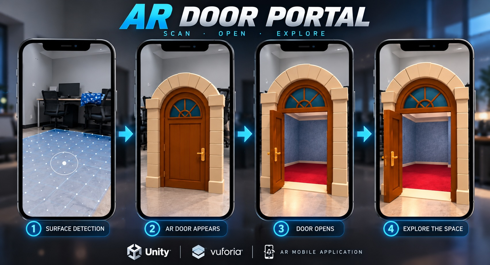

# AR Door Portal

An Augmented Reality door portal prototype developed using Unity and Vuforia during my industrial training at Battery Low Interactive Ltd.

## Project Preview

## Overview

The AR Door Portal prototype was developed to explore plane-based Augmented Reality and interactive 3D content.

The application detects a suitable real-world surface and places a virtual doorway with an interior environment into the scene. The door can then be opened to create an interactive portal experience.

## Key Features

- Real-world surface detection
- AR door placement
- 3D portal environment
- Door opening animation
- Interactive AR experience
- Real-world and virtual environment integration

## Technologies

- Unity
- C#
- Vuforia
- Augmented Reality
- 3D Models

## Development Experience

Through this prototype, I gained practical experience in:

- AR scene setup
- Surface detection
- 3D object placement
- AR interaction
- Animation
- Unity scene management
- Mobile AR development

## Demo

[Watch the AR Door Portal Demo](Assets/ar-door-portal-demo.mp4)

## Project Context

This prototype was developed as part of my **AR/VR/XR industrial training at Battery Low Interactive Ltd.**
